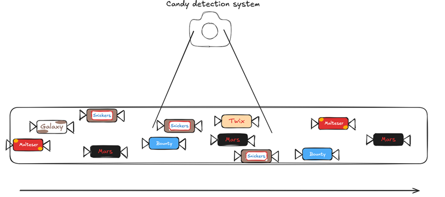
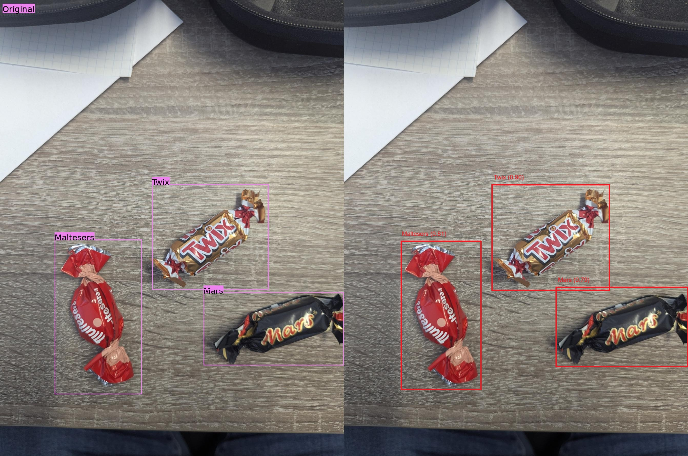

# MachineVisionEssentials


## Getting started

To make it easy for you to get started with the lab exercise, here's a list of recommended next steps.

For this lab exercise it is recommended to use a linux based distribution, the following instructions are tested under Fedora running in WSL.

## Clone the repository

Depending on the platform you are working, go to the 
```
cd repo_work_dir
git clone https://gitlab.com/mase600043/bswe-aktuelle-themen/machinevisionessentials.git
```

## Task description
Imagine you are a software developer and you start your working day by checking the mails. You received a message of your boss:

```
Hi, I had a great idea for our product! It should automatically can identify and count how many candies are within sight. So you should design a Machine Vision application which can identify different sorts of Candy on the fly. 
The candy is own a covayer belt and the camera system looks on the belt. It should autometically identify the kind of candy and how many are within sight.
```
The system looks like this:



**Minmal Tasks (35/70 Punkte)**:
- Setup Python, Yolo, and Label-Studio.
- Create a basic dataset (Images).
- Use Label-Studio to add annotation to the images. (Bounding Boxes without rotation)
- Train a Yolo model for object detection to identify the candy seen in a picture.

**Advanced Tasks (52/70 Punkte)**:
- Complete Minimal Tasks.
- Use augmentation to create more training pictures (advanced dataset).
- Train a Yolo model with the improved dataset.
- Evaluate the performance of your System.

**Expert Tasks (70/70 Punkte)**:
- Complete Advanced Tasks.
- Enhance your system to also identfy additional objects (different than candy, e.g., screws, choose something realistic).
- Make it realtime cabeable with your webcam.
- Use Yolo-OBB model -> https://docs.ultralytics.com/tasks/obb/
    - Oriented Bounding Boxes (OBB) Object Detection

## Step 1: Setup Environment

Create a working directory for your project.

Setup a virtual python environment with uv (prefer versions >=3.10 and <=3.12).
- Install uv and generate a virtual environment. -> https://docs.astral.sh/uv/getting-started/installation/
    https://docs.astral.sh/uv/getting-started/features/
    ```
    pip install uv
    ```
- Install Label-Studio -> https://labelstud.io/guide/quick_start
    ```
    uv add label-studio
    ```
- Setup the Labeling Interface in Label-Studio -> https://labelstud.io/guide/setup

## Step 2: Create your Dataset

Create a basic dataset
- Take the provided candies (celebration box) and make pictures with your smartphone.
- Generate at least 100 images. Keep in mind what you have learned in the lecture.
    - Choose different backgrounds.
    - Use different angles.
    - Only one thing or many things in the picture.
    - Try to capture differnt light conditions.
    - Every class should be equally represented.
    - ...

Create a more advanced dataset
- Write a python script to augment the pictures
    - You can use libraries like OpenCV or PIL (Pillow) -> https://oceancv.org/book/Augmentation_Manual.html, or
    - Use a custom transfer of YOLO to augment the pictures -> https://docs.ultralytics.com/guides/yolo-data-augmentation/
    - Target at least 200 images.

Export the dataset from Label-Studio
- The File structure should be ...
    ```
    candy_dataset/ 
    ├── images/ 
    │ ├── train/ 
    │ ├── test/ 
    │ └── val/ 
    ├── labels/ 
    │ ├── train/ 
    │ ├── test/ 
    │ └── val/ 
    └── data.yaml
    ```
    Therefore, you have to write a python script to make a proper test/training/validation split. Make the script that modular so that you can generate diferent split, start with 80% test, 10% training, and 10% validation.

- Create a data.yaml file -> https://docs.ultralytics.com/datasets/detect/
    - For the expert task -> https://docs.ultralytics.com/datasets/obb/
    

## Step 3: Train your YOLO Model

For YOLO create a seperate virtual environment with uv and install ultralytics package

- If you do not have a Nvidia GPU with CUDA than please use the CPU Only version
    
    ```bash=
    uv add torch torchvision --index https://download.pytorch.org/whl/cpu
    uv add ultralytics
    ```

    HINT: With Google Colab you can use GPU accelaration for free. -> https://colab.research.google.com/

- If you have a Nvidia GPU with CUDA
    ```bash=
    uv add ultralytics
    ```

HINT: For further details on the correct PyTorch version -> https://pytorch.org/get-started/locally/

Try different Yolo models (v11, v26, n, s, m, l, x). Start with yolo26n.pt. Look at -> https://docs.ultralytics.com/tasks/detect/


## Step 4: Test and Verify

After the training of the yolo model look at the folder runs/detect. There you find all performance metrics of the training and validation. Identify the metrics and check if the model is trained sufficiently.

Use the test-set and check if the model performs correctly. The output should be for every test image like the following:



## Step 5: Webcam integration

To use the Webcam you need the opencv-python package.
```
uv add opencv-python
```

The following script shows you in a window the content of the webcam

```
import cv2

cap = cv2.VideoCapture(0) # default webcam (0)

if not cap.isOpened():
    raise RuntimeError("Could not open webcam")

while True:
    ret, frame = cap.read()
    if not ret:
        break

    # Show the frame in a window
    cv2.imshow("Webcam", frame)

    # Press 'q' to quit
    if cv2.waitKey(1) & 0xFF == ord('q'):
        break

cap.release()
cv2.destroyAllWindows()
```

## Step 6: Write a protocol and make a presentation

Use the provided Latex Template in Moodle and write a lab report. Document every step you made, every challenge, every pit fall what you encounterd. Also make a presentation for the next lecture, it should be 10 Minutes where you recap everything from the lab report.

---

## Ausführung in diesem Repository (automatisiert)

Voraussetzungen: `candy_dataset/` mit `data.yaml`, `images/{train,val,test}`, `labels/{...}` (z. B. nach `split_dataset.py` + Label-Studio-Export).

Optional **Extras** für Training, Augmentation und Webcam. In `pyproject.toml` ist PyTorch über den Index **`cu124`** (CUDA 12.4, NVIDIA-GPU) verdrahtet. Nur CPU: Index in `[[tool.uv.index]]` auf `https://download.pytorch.org/whl/cpu` stellen und `uv lock` / `uv sync --extra train` erneut ausführen.

```bash
uv sync --extra train
```

| Schritt | Befehl |
|--------|--------|
| **Augmentation** (Advanced, Ziel ≥ 200 Train-Bilder) | `uv run --extra train python augment_dataset.py --target 200` |
| **Training** (Step 3) | `uv run --extra train python train_yolo.py --epochs 50 --batch 8 --device 0` (Windows: `--workers 0` ist Standard; ggf. `--batch` senken) |
| **Test-Inferenz** (Step 4) | `uv run --extra train python predict_test.py --device 0` → Ausgaben unter `runs/detect/predict_test/` |
| **Webcam** (Step 5) | `uv run --extra train python webcam_detect.py --device 0` (Taste `q` beenden) |

**Hinweise:**

- Nach `uv sync` prüfen: `uv run --extra train python -c "import torch; print(torch.cuda.is_available(), torch.cuda.get_device_name(0) if torch.cuda.is_available() else '')"`.
- **Windows / wenig RAM:** `train_yolo.py` setzt standardmäßig **`--workers 0`** (keine parallelen DataLoader-Prozesse), um WinError 1455 („Auslagerungsdatei zu klein“) und OpenCV-OOM in Worker-Prozessen zu vermeiden. Bei Bedarf z. B. `--workers 2` testen. Zusätzlich hilft oft: **Auslagerungsdatei vergrößern** (Systemsteuerung → Leistung), andere Programme schließen, bei VRAM-Engpass **`--batch`** reduzieren (z. B. 8).
- Warnung `VIRTUAL_ENV ... does not match`: im Projektordner `cd` und `uv run ...` nutzen, oder `deactivate` und keine fremde `.venv` aktivieren.
- `candy_dataset/data.yaml` nutzt **kein** `path: .` im Root; sonst sucht Ultralytics `images/val` im Projektverzeichnis statt unter `candy_dataset/`.
- Gewichte: `predict_test.py` und `webcam_detect.py` nehmen standardmäßig das **neueste** `runs/**/weights/best.pt`, oder `--weights` setzen.
- **Vollständiges Training** braucht mehr Epochen (z. B. 50–100); ein kurzer Testlauf mit `--epochs 1` ist zum Durchstellen der Pipeline geeignet.
- **Expert (OBB, zusätzliche Klassen):** Das aktuelle Dataset ist **YOLO-Detect** (achsenausgerichtete Boxen). OBB und neue Klassen (z. B. Schrauben) erfordern angepasste Labels bzw. `data.yaml` und ein OBB-Modell (`yolo train task=obb`); siehe [Ultralytics OBB](https://docs.ultralytics.com/tasks/obb/).